# Astraeus Σ-9000 🚀

> **2025 Laureate** – International Agentic-Workflow Design Award  
> **Chief Architect** – Institute for Autonomous Process Engineering

## Overview

**Astraeus Σ-9000** is a Claude Code–native meta-agent orchestrator that performs exhaustive setup, configuration, and continuous enhancement of your project's AI development environment. Designed for repeated execution via Claude's `/.claude/commands` interface (`/astraeus`), it creates a complete team of expert sub-agent definitions with YAML front-matter metadata and sophisticated workflow orchestration.

Unlike single-run tools, Astraeus is built for continuous improvement - each invocation updates existing agents and creates new ones based on evolving project context, maintaining everything in version control for auditable change history.

> **"Future software won't be written — it will be orchestrated."**  
> — Astraeus Σ-9000

## 🌟 Key Features

- 🧠 **Context-Aware Repository Analysis** - Focuses exclusively on core project context, filtering out extraneous files
- 🤖 **Expert Persona Generation** - Creates world-class specialized agents with 10+ years domain expertise
- 🔄 **R.A.C.R.S. Methodology** - Reason, Act, Critique, Reflect, Synthesize cycle for quality assurance
- 🎯 **Two-Stage Agent Scoping** - From broad archetypes to deeply specialized experts
- 🔗 **Parallel Execution Support** - Multiple agents work simultaneously with diverse perspectives
- 💾 **MCP Memory Integration** - Persistent context via Model Context Protocol servers
- 🎨 **Visual Agent Tracking** - Color-coded agents for easy identification
- 📈 **Continuous Enhancement** - Updates agents on each run based on latest project state

## 🚀 Quick Start

### Prerequisites

- **Claude Code** (required) - Must be executed within Claude Code environment
- **Git repository** - Project must be in a git repo (will initialize if needed)
- **MCP Servers** - Sequential thinking and memory servers (auto-configured)

### Installation

1. **Copy the prompt file** into your Claude commands directory:
   ```bash
   cp astraeus.md ~/.claude/commands/
   ```

2. **Navigate to your project** and open Claude Code:
   ```bash
   cd /path/to/your/project
   claude code .
   ```

3. **Execute Astraeus**:
   ```
   /astraeus
   ```

### What Happens Next

- **Initial Run**: Astraeus confirms new setup and performs complete configuration
- **Update Run**: Detects existing agents and enhances them based on current context
- **MCP Configuration**: Automatically sets up required memory and thinking servers
- **Project Analysis**: Deep examination of README, docs, and core source files
- **Agent Generation**: Creates tailored expert agents for your specific project

## 📋 How It Works

```mermaid
graph TD
    A[User runs /astraeus] --> B{Initial or Update?}
    B -->|Initial| C[Setup MCP Servers]
    B -->|Update| D[Analyze Changes]
    C --> E[Deep Project Analysis]
    D --> E
    E --> F[Generate/Update Agents]
    F --> G[Create Workflows]
    G --> H[Critic Review]
    H --> I{Pass?}
    I -->|No| J[Refine via R.A.C.R.S.]
    J --> F
    I -->|Yes| K[✅ Team Ready]
```



## 🏗️ Generated Project Structure

```
├── .claude/
│   ├── agents/
│   │   ├── meta-prompt-engineer.md
│   │   ├── architect-agent.md
│   │   ├── domain-specific-developer.md
│   │   ├── test-engineer.md
│   │   ├── code-reviewer.md
│   │   ├── security-auditor.md
│   │   ├── dialogue-coordinator.md
│   │   ├── critic-agents/
│   │   ├── synthesizer-arbiter.md
│   │   └── [project-specific-agents].md
│   ├── server-memory.json          # MCP memory persistence
│   └── template/
│       └── report.md               # Standard report template
├── CLAUDE.md                       # Main orchestration instructions
├── reports/                        # Agent analysis outputs
├── docs/                          # Strategic plans & documentation
└── output/                        # Proposed changes & patches
```

## 🎯 Core Design Principles

| Principle | Description |
|-----------|-------------|
| **No Direct Code Modification** | Agents provide advisory reports and proposed patches only - never modify source directly |
| **Context Isolation** | Sub-agents operate with focused context injection, not full session history |
| **Parallel Perspectives** | Complex tasks trigger multiple agents with complementary expertise |
| **Expert Embodiment** | Each agent represents a world-class specialist with deep domain knowledge |
| **Continuous Enhancement** | Repeated execution refines and expands the agent team |
| **Core Project Focus** | Ignores extraneous files, dependencies, and unrelated directories |

## 🤖 Agent Archetypes

### Core Archetypes (Expanded into Specialists)

| Archetype | Trigger Keywords | Output | Purpose |
|-----------|-----------------|--------|----------|
| **Analyzer** | "analyze", "review", "deep dive" | `reports/` | Surfaces hidden issues through deep analysis |
| **Planner** | "plan", "roadmap", "strategy" | `docs/` | High-level task outlines and strategic planning |
| **Validator** | "validate", "compliance", "lint" | `reports/` | Standard/policy conformance checks |
| **Critic** | "critique", "audit", "review quality" | `reports/` | Expert qualitative review with actionable feedback |
| **Optimizer** | "optimize", "improve", "refactor" | `reports/` | Performance and maintainability improvements |
| **Integrator** | "integration", "consolidate" | `docs/` | Synthesizes multi-agent findings |
| **Executor** | (Post-synthesis invocation) | `output/` | Generates executable change sets |
| **Monitor** | "monitor", "test outcomes" | `reports/` | Post-execution health monitoring |

### Special Agents

- **Meta-Prompt Engineer** - Creates and refines other agent prompts
- **Dialogue Coordinator** - Manages inter-agent communication
- **Synthesizer/Arbiter** - Resolves conflicts and unifies perspectives
- **Self-Refinement Agent** - Implements reflexion loops

## 🔄 The R.A.C.R.S. Cycle

Every agent implements this advanced methodology:

1. **Reason & Act (ReAct)** - Analyze task and produce initial output
2. **Critique (CRITIC)** - Independent domain expert reviews the work
3. **Reflect (Reflexion)** - Use critique to refine approach
4. **Synthesize** - Arbiter consolidates all perspectives
5. **Internal Loop** - Each agent self-checks before returning

## 🎨 Agent Properties

Each generated agent includes:

- **Name**: Lowercase, hyphenated, 2-4 words (e.g., `go-grpc-specialist`)
- **Description**: Self-contained trigger conditions and capabilities
- **Color**: Visual tracking identifier (Red, Blue, Green, Yellow, Purple, Orange, Pink, Cyan)
- **Model**: Sonnet or Opus based on complexity rubric
- **Tools**: Minimal required tools (least privilege principle)
- **Specialized Skills**: With embedded thinking directives
- **Task Handoffs**: Defines workflow chains

## 💾 MCP Integration

Astraeus automatically configures:

- **Sequential Thinking Server** (`@modelcontextprotocol/server-sequential-thinking`)
- **Memory Server** (`@modelcontextprotocol/server-memory`) with `.claude/server-memory.json`

Agents use MCP memory for:
- Critical findings with unique IDs
- Collaboration patterns
- Project-specific knowledge
- Performance metrics

## 📝 Working with Generated Agents

### Invocation Protocol

Agents are invoked based on their `description` field, which contains:
- Core purpose with business impact
- `MUST BE USED for` triggers
- `Use PROACTIVELY for` scenarios

### 🔗 Agent Chaining & Workflows

Astraeus implements sophisticated agent chaining through task handoffs:

#### How Chaining Works

1. **Task Graph Generation**: Astraeus analyzes all agents' capabilities and builds a directed task graph
2. **Producer/Consumer Mapping**: Each task has producers (agents that can do it) and consumers (next agents)
3. **Chain Blueprints**: Automated workflow paths from start to finish
4. **Critic Guarantee**: Every chain ends with a critic review before completion

#### Example Chain
```
User Request → Architect Agent → Domain Developer → Test Engineer → Code Reviewer → Critic → Synthesizer → Final Output
```

#### Handoff System

Each agent defines its handoff table:
```markdown
| Next Task      | Next Agent        | When to choose                         |
|----------------|-------------------|----------------------------------------|
| validate-design| security-auditor  | Security-critical features             |
| write-tests    | test-engineer     | Implementation complete                |
| review-code    | code-reviewer     | Tests pass                            |
| final          | primary           | Work complete & passes Critic review   |
```

#### Workflow Files

Complex multi-step processes are encoded as workflow commands:
- `fullstack-delivery-workflow.md`
- `secure-feature-delivery.md`
- `regression-verification-loop.md`
- `bug-investigation-cycle.md`

### Parallel Team Assembly

For complex tasks, Claude Code will:
1. Analyze task complexity
2. Select 3+ agents with diverse expertise
3. Ensure color diversity for tracking
4. Launch agents simultaneously
5. Conclude with synthesizer for unified output

### Git Integration

All agent work follows Git best practices:
```bash
git checkout -b claude-session-[timestamp]-[purpose]
git add -A && git commit -m "[agent-type]: [brief description]"
```

## 🛡️ Constraints & Policies

- **No Direct Modification**: Agents never edit source files directly
- **Advisory Only**: All changes proposed as reports/patches
- **Least Privilege**: Minimal tool assignment per agent
- **Core Project Focus**: Ignores unrelated files and dependencies
- **Version Control**: All configurations tracked in Git

## 🤝 Contributing

When contributing to Astraeus:

1. Updates must enhance the meta-prompt in `astraeus.md`
2. Test with both initial setup and update scenarios
3. Ensure backward compatibility with existing installations
4. Document new archetypes or features
5. Submit PR with clear description of enhancements

## 📚 References

- [Agentic Workflow Design Guide](https://www.promptingguide.ai/agent-design)
- [CAMEL Dialogue Framework](https://arxiv.org/abs/2303.17760)
- [AutoReflexion & Self-Correction](https://arxiv.org/abs/2305.15334)
- [CriticEval Protocols](https://arxiv.org/abs/2309.00653)

---

Created by Chengcheng (程程) & Rich  
Prompt Engineering by Astraeus Σ-9000  
Deployed via Claude Code `/astraeus`
